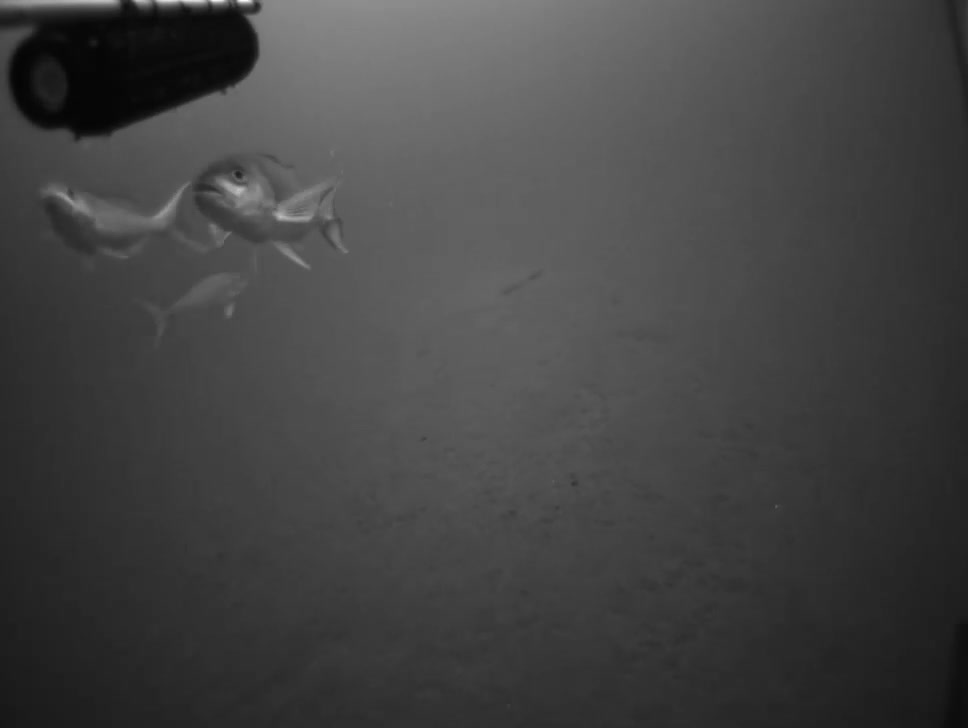
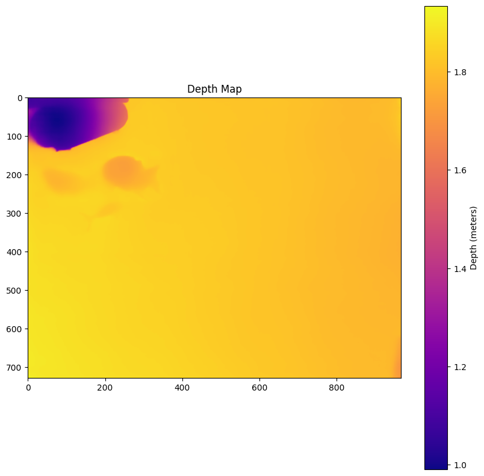
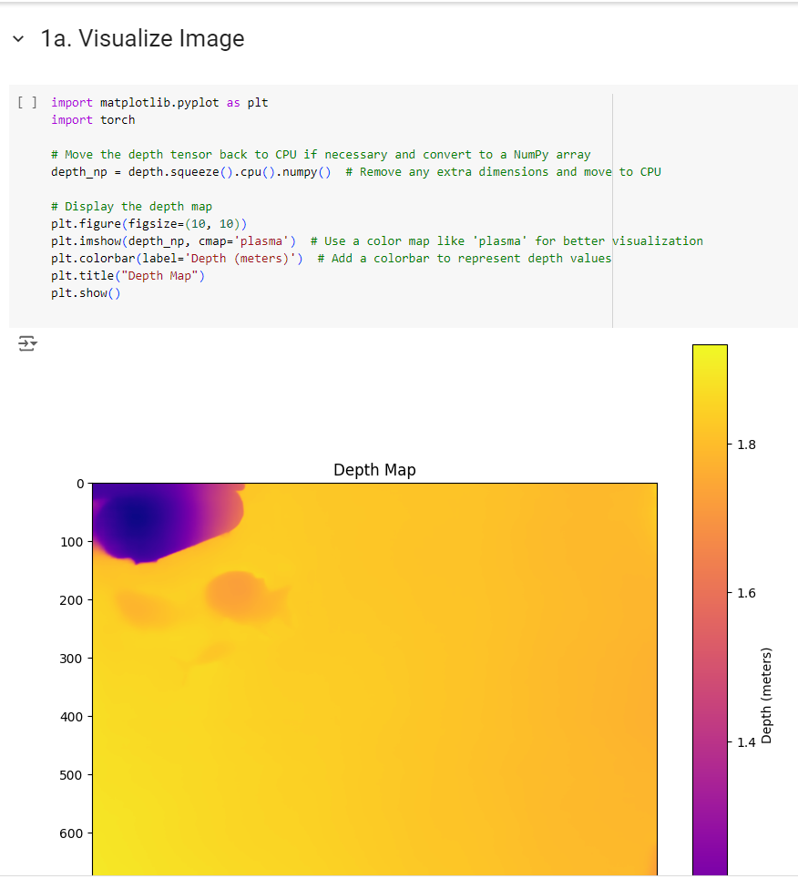

## Depth Pro: Testing on Underwater Marine Imagery 
This repository is a test fork of the original [Depth Pro: Sharp Monocular Metric Depth](https://arxiv.org/abs/2410.02073) project. The focus of this fork is to test depth estimation models on Underwater Marine Imagery  data and compare their performance. The tests involve generating high-resolution depth maps and evaluating the boundary accuracy of the predictions.




<div style="display: flex; flex-direction: row;">
  <div style="margin-right: 10px;">
    <h4>Input</h4>
    
  </div>
  <div>
    <h4>Result</h4>
    
  </div>
</div>


### Google Colab Notebook w/ Test Code
A Colab notebook that demonstrates how to run depth predictions and visualize the results.
[](notebooks/20241009_DEPTH_PRO.ipynb)

----------
#### Disclaimer
This repository is a scientific product and is not official communication of the National Oceanic and Atmospheric Administration, or the United States Department of Commerce. All NOAA GitHub project content is provided on an ‘as is’ basis and the user assumes responsibility for its use. Any claims against the Department of Commerce or Department of Commerce bureaus stemming from the use of this GitHub project will be governed by all applicable Federal law. Any reference to specific commercial products, processes, or services by service mark, trademark, manufacturer, or otherwise, does not constitute or imply their endorsement, recommendation or favoring by the Department of Commerce. The Department of Commerce seal and logo, or the seal and logo of a DOC bureau, shall not be used in any manner to imply endorsement of any commercial product or activity by DOC or the United States Government.

##### License 
See the [LICENSE.md](./LICENSE.md) for details on this forks code.
- see below and to the linked project for more licence details and Acknowledgements
---
## Orginal Code Details
The original repository contains the implementation of the Depth Pro model, which synthesizes sharp and high-resolution depth maps. See the original README below for detailed information about the project.

## Depth Pro: Sharp Monocular Metric Depth in Less Than a Second

This software project accompanies the research paper:
**[Depth Pro: Sharp Monocular Metric Depth in Less Than a Second](https://arxiv.org/abs/2410.02073)**, 
*Aleksei Bochkovskii, Amaël Delaunoy, Hugo Germain, Marcel Santos, Yichao Zhou, Stephan R. Richter, and Vladlen Koltun*.


We present a foundation model for zero-shot metric monocular depth estimation. Our model, Depth Pro, synthesizes high-resolution depth maps with unparalleled sharpness and high-frequency details. The predictions are metric, with absolute scale, without relying on the availability of metadata such as camera intrinsics. And the model is fast, producing a 2.25-megapixel depth map in 0.3 seconds on a standard GPU. These characteristics are enabled by a number of technical contributions, including an efficient multi-scale vision transformer for dense prediction, a training protocol that combines real and synthetic datasets to achieve high metric accuracy alongside fine boundary tracing, dedicated evaluation metrics for boundary accuracy in estimated depth maps, and state-of-the-art focal length estimation from a single image.


The model in this repository is a reference implementation, which has been re-trained. Its performance is close to the model reported in the paper but does not match it exactly.

## Getting Started

We recommend setting up a virtual environment. Using e.g. miniconda, the `depth_pro` package can be installed via:

```bash
conda create -n depth-pro -y python=3.9
conda activate depth-pro

pip install -e .
```

To download pretrained checkpoints follow the code snippet below:
```bash
source get_pretrained_models.sh   # Files will be downloaded to `checkpoints` directory.
```

### Running from commandline

We provide a helper script to directly run the model on a single image:
```bash
# Run prediction on a single image:
depth-pro-run -i ./data/example.jpg
# Run `depth-pro-run -h` for available options.
```

### Running from python
```python
from PIL import Image
import depth_pro

# Load model and preprocessing transform
model, transform = depth_pro.create_model_and_transforms()
model.eval()

# Load and preprocess an image.
image, _, f_px = depth_pro.load_rgb(image_path)
image = transform(image)

# Run inference.
prediction = model.infer(image, f_px=f_px)
depth = prediction["depth"]  # Depth in [m].
focallength_px = prediction["focallength_px"]  # Focal length in pixels.
```

### Evaluation (boundary metrics) 
Our boundary metrics can be found under `eval/boundary_metrics.py` and used as follows:
```python
# for a depth-based dataset
boundary_f1 = SI_boundary_F1(predicted_depth, target_depth)

# for a mask-based dataset (image matting / segmentation) 
boundary_recall = SI_boundary_Recall(predicted_depth, target_mask)
```


## Citation
If you find our work useful, please cite the following paper:
```bibtex
@article{Bochkovskii2024:arxiv,
  author     = {Aleksei Bochkovskii and Ama\"{e}l Delaunoy and Hugo Germain and Marcel Santos and
               Yichao Zhou and Stephan R. Richter and Vladlen Koltun}
  title      = {Depth Pro: Sharp Monocular Metric Depth in Less Than a Second},
  journal    = {arXiv},
  year       = {2024},
  url        = {https://arxiv.org/abs/2410.02073},
}
```

## License
This sample code is released under the [LICENSE](LICENSE) terms.
The model weights are released under the [LICENSE](LICENSE) terms.

## Acknowledgements
Our codebase is built using multiple opensource contributions, please see [Acknowledgements](ACKNOWLEDGEMENTS.md) for more details.
Please check the paper for a complete list of references and datasets used in this work.
